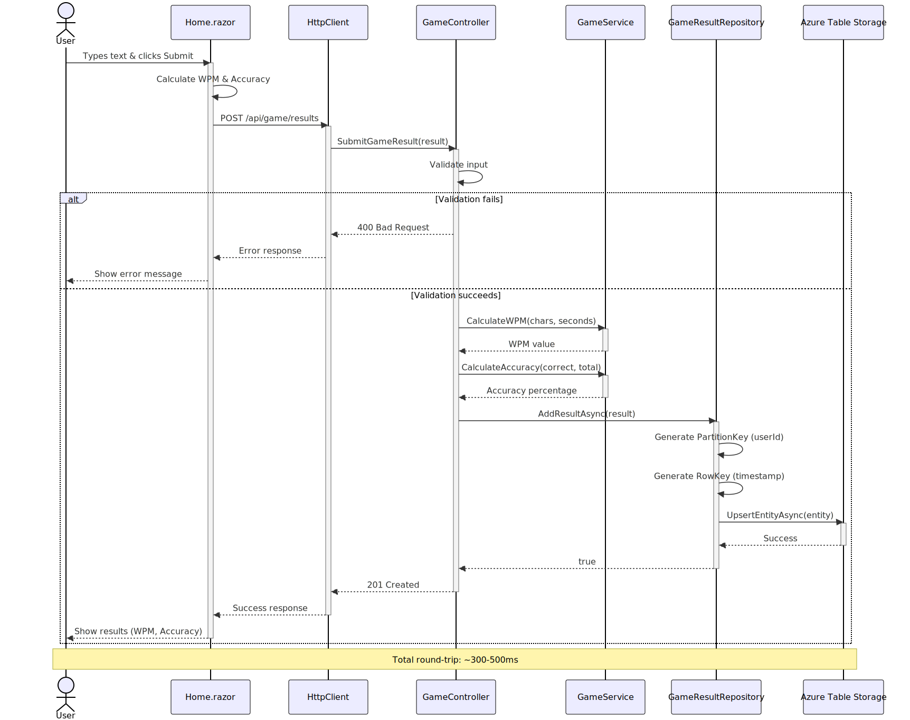

# PoFastType

[](https://github.com/YOUR_USERNAME/PoFastType/actions/workflows/ci.yml)
[](https://github.com/YOUR_USERNAME/PoFastType/actions/workflows/cd.yml)
[](https://github.com/YOUR_USERNAME/PoFastType/actions/workflows/pr-validation.yml)

A modern typing speed test application built with .NET 10 and Blazor WebAssembly. Test your typing speed, track your progress, and compete on the leaderboard!

## 🚀 Features

- **Real-time Typing Tests** - Test your typing speed with randomly generated text
- **Personal Statistics** - Track your WPM, accuracy, and improvement over time
- **Global Leaderboard** - Compete with other users for the top spot
- **Responsive Design** - Works seamlessly on desktop and mobile devices
- **Azure-Powered** - Scalable infrastructure with Azure Table Storage and App Service

## 📚 Documentation

- **[docs/PRD.md](docs/PRD.md)** - Product Requirements Document with detailed UI component specifications
- **[AGENTS.md](AGENTS.md)** - AI Coding Agent Guide with project conventions and gotchas
- **[docs/README.md](docs/README.md)** - Documentation index
- **[docs/kql/](docs/kql/)** - KQL query library for Application Insights monitoring
- **[src/PoFastType.Api/README.md](src/PoFastType.Api/README.md)** - Backend API documentation
- **[src/PoFastType.Client/README.md](src/PoFastType.Client/README.md)** - Frontend Blazor documentation
- **[src/PoFastType.Shared/README.md](src/PoFastType.Shared/README.md)** - Shared models and DTOs documentation
- **[tests/PoFastType.Tests/README.md](tests/PoFastType.Tests/README.md)** - Comprehensive test suite documentation

## 🏗️ Architecture

This project follows **Vertical Slice Architecture** with **Clean Architecture principles**:

- **src/PoFastType.Api** - ASP.NET Core Web API backend
- **src/PoFastType.Client** - Blazor WebAssembly frontend (hosted in API)
- **src/PoFastType.Shared** - Shared models and contracts
- **tests/PoFastType.Tests** - Comprehensive test suite (96 tests, 31.34% coverage)

### Technology Stack

- **Frontend:** Blazor WebAssembly, Radzen UI Components
- **Backend:** .NET 10, ASP.NET Core Web API
- **Database:** Azure Table Storage (Azurite for local development)
- **Monitoring:** Application Insights, Serilog, OpenTelemetry
- **CI/CD:** GitHub Actions with Azure Developer CLI
- **Infrastructure:** Azure App Service + Bicep IaC

### Architecture Diagrams

<details>
<summary>📊 Click to view architecture diagrams</summary>

#### Project Dependencies

<details>
<summary>Simple version</summary>


</details>

#### Domain Model (Class Diagram)

<details>
<summary>Simple version</summary>


</details>

#### API Call Flow (Sequence Diagram)

<details>
<summary>Simple version</summary>


</details>

#### Game Play Use Case (Flowchart)

<details>
<summary>Simple version</summary>


</details>

#### Blazor Component Hierarchy

<details>
<summary>Simple version</summary>


</details>

</details>

## 📋 Prerequisites

- [.NET 10.0 SDK](https://dotnet.microsoft.com/download/dotnet/10.0)
- [Azure Developer CLI (azd)](https://aka.ms/azure-dev/install)
- [Azure CLI (az)](https://docs.microsoft.com/cli/azure/install-azure-cli)
- [Node.js](https://nodejs.org/) (for Azurite)
- An Azure subscription ([free account](https://azure.microsoft.com/free/))

## 🛠️ Local Development

### 1. Clone the repository

```powershell
git clone https://github.com/YOUR_USERNAME/PoFastType.git
cd PoFastType
```

### 2. Start Azurite (local Azure Storage emulator)

```powershell
.\scripts\start-azurite.ps1
```

### 3. Run the application

```powershell
dotnet run --project src/PoFastType.Api
```

Or press **F5** in Visual Studio/VS Code.

### 4. Access the application

- **App:** https://localhost:5001
- **Swagger API:** https://localhost:5001/swagger
- **Health Check:** https://localhost:5001/api/health
- **Diagnostics:** https://localhost:5001/diag

## 🧪 Testing

Run all tests:

```powershell
dotnet test
```

Run specific test categories:

```powershell
# Unit tests only
dotnet test --filter "FullyQualifiedName~Unit"

# Integration tests only
dotnet test --filter "FullyQualifiedName~Integration"

# API tests only
dotnet test --filter "FullyQualifiedName~API"
```

### Test Coverage

```powershell
dotnet test --collect:"XPlat Code Coverage"
```

**Current Coverage:** 31.34% (96 tests)

## 🚢 Deployment

### Azure App Service Deployment

This application is deployed to **Azure App Service** using the **F1 Free Tier** on a shared App Service Plan (`PoShared/PoSharedAppServicePlan`).

**Deployment Details:**
- **App Service:** PoFastType
- **App Service Plan:** PoSharedAppServicePlan (F1 - Free Tier)
- **Resource Group:** PoShared
- **Region:** Configured via `AZURE_LOCATION` environment variable
- **Hosting:** Blazor WebAssembly hosted in .NET API project (no separate static hosting needed)

### Quick Deployment to Azure

Using Azure Developer CLI (azd):

```powershell
# Login to Azure
azd auth login

# Deploy infrastructure and application
azd up
```

### GitHub Actions CI/CD

The project uses a **simplified CD workflow** that runs on every push to `main`:

**Workflow Steps:**
1. **Build** - Restore dependencies and build solution
2. **Test** - Run all tests (excluding E2E tests)
3. **Deploy** - Deploy to Azure App Service using `azd up`
4. **Health Check** - Validate deployment with `/api/health` endpoint

**Required GitHub Secrets:**
- `AZURE_CREDENTIALS` - Service principal credentials for Azure authentication
- `AZURE_SUBSCRIPTION_ID` - Your Azure subscription ID
- `AZURE_LOCATION` - Deployment region (e.g., `eastus`, `westus2`)

**Deployment Configuration:**
- Infrastructure: Defined in `infra/resources.bicep`
- Deployment settings: Configured in `azure.yaml`
- CD workflow: `.github/workflows/cd.yml`

### Manual Deployment

```powershell
# Build the solution
dotnet build

# Run tests
dotnet test --filter "FullyQualifiedName!~E2E"

# Deploy to Azure
azd up
```

### Post-Deployment Validation

After deployment, verify the application is working:

- **Health Check:** `https://<your-app-name>.azurewebsites.net/api/health`
- **Swagger API Docs:** `https://<your-app-name>.azurewebsites.net/swagger`
- **Application:** `https://<your-app-name>.azurewebsites.net`
- **Diagnostics:** `https://<your-app-name>.azurewebsites.net/diag`

For detailed deployment instructions and troubleshooting, see the [Azure Best Practices documentation](https://learn.microsoft.com/azure/app-service/).

### CI/CD Pipeline

The project includes automated GitHub Actions workflows:

- **CI (Continuous Integration)** - Runs on every push and PR
  - Builds the solution
  - Runs all tests (excluding E2E)
  - Validates code formatting
  - Scans for security vulnerabilities

- **CD (Continuous Deployment)** - Deploys to Azure on push to `main`
  - Provisions Azure infrastructure
  - Deploys the application
  - Validates with health checks
  - Runs smoke tests
  - Auto-creates issue on failure

- **PR Validation** - Runs on every pull request
  - Validates code quality
  - Posts results as PR comment
  - Auto-labels PRs

## 📊 Monitoring & Health Checks

The application includes comprehensive health checks:

1. **Internet Connection** - Verifies external connectivity
2. **Azure Connectivity** - Tests Azure service availability
3. **Self Health Check** - Validates internal API health
4. **API Endpoint** - Tests critical API endpoints
5. **Azure Table Storage** - Verifies database connectivity
6. **OpenAI Service** - Tests AI service integration (if configured)

**Health Check Endpoint:** `/api/diag/health`

**Diagnostics UI:** `/diag`

## 🔐 Security

- ✅ HTTPS enforced for all traffic
- ✅ Secrets managed via Azure App Service configuration
- ✅ Private GitHub repository
- ✅ TLS 1.2+ minimum
- ✅ Storage encryption (Microsoft-managed keys)
- ✅ Automated security scanning in CI pipeline

## 📁 Project Structure

```
PoFastType/
├── .github/
│   └── workflows/              # GitHub Actions CI/CD workflows
├── .vscode/
│   ├── launch.json             # F5 debug configuration
│   └── tasks.json              # Build tasks
├── docs/                       # Documentation
│   ├── Diagrams/               # Mermaid architecture diagrams (.mmd and .svg)
│   ├── kql/                    # KQL queries for Application Insights
│   ├── coverage/               # Code coverage reports
│   ├── PRD.md                  # Product Requirements Document
│   └── README.md               # Documentation index
├── infra/                      # Bicep infrastructure templates
│   ├── main.bicep              # Main infrastructure template
│   ├── main.parameters.json    # Infrastructure parameters
│   └── resources.bicep         # Azure resources (App Insights, App Service, Storage)
├── scripts/                    # Automation scripts
│   ├── start-azurite.ps1       # Start local Azure Storage emulator (Windows)
│   ├── start-azurite.sh        # Start local Azure Storage emulator (Linux/macOS)
│   ├── run-coverage.ps1        # Run code coverage analysis (Windows)
│   └── run-coverage.sh         # Run code coverage analysis (Linux/macOS)
├── src/                        # Source code
│   ├── PoFastType.Api/         # Backend API project
│   │   ├── Controllers/        # API controllers (Game, Scores, Diag, User)
│   │   ├── Services/           # Business logic services
│   │   ├── Repositories/       # Data access layer (Azure Table Storage)
│   │   ├── Middleware/         # Global exception handling (RFC 7807)
│   │   └── HealthChecks/       # Health check implementations
│   ├── PoFastType.Client/      # Blazor WebAssembly frontend
│   │   ├── Pages/              # Razor pages (Home, Leaderboard, UserStats, Diag)
│   │   ├── Components/         # Reusable UI components (Navbar, ErrorBoundary)
│   │   ├── Layout/             # Application layout (MainLayout)
│   │   └── Services/           # Frontend services (GameState, UserService)
│   └── PoFastType.Shared/      # Shared models and DTOs
│       └── Models/             # Domain models (GameResult, UserIdentity, etc.)
├── tests/                      # Test projects
│   └── PoFastType.Tests/       # Comprehensive test suite (96 tests, 31.34% coverage)
│       ├── Unit/               # Unit tests (services, repositories)
│       ├── Integration/        # Integration tests (with Azurite)
│       ├── API/                # API endpoint tests
│       ├── E2E/                # End-to-end tests (Playwright)
│       └── System/             # System-level tests
├── Directory.Packages.props    # Centralized package management
├── global.json                 # .NET SDK version lock (10.0.100)
├── PoFastType.sln              # Solution file
├── PoFastType.http             # API test collection
├── AGENTS.md                   # AI Coding Agent Guide
├── README.md                   # This file
└── azure.yaml                  # Azure Developer CLI configuration
```
└── azure.yaml              # Azure Developer CLI configuration
```

## 🤝 Contributing

1. Create a feature branch: `git checkout -b feature/my-feature`
2. Make your changes following the coding guidelines
3. Run tests: `dotnet test`
4. Format code: `dotnet format`
5. Commit changes: `git commit -am 'Add my feature'`
6. Push to branch: `git push origin feature/my-feature`
7. Create a Pull Request

**Code Quality Checks:**
- All tests must pass
- Code must be properly formatted (`dotnet format`)
- No security vulnerabilities
- Minimum 1 code review approval

## 📝 License

This project is private and proprietary.

## 🙏 Acknowledgments

- Built with [Blazor](https://dotnet.microsoft.com/apps/aspnet/web-apps/blazor)
- UI components by [Radzen](https://blazor.radzen.com/)
- Hosted on [Azure App Service](https://azure.microsoft.com/services/app-service/)
- Infrastructure as Code with [Bicep](https://learn.microsoft.com/azure/azure-resource-manager/bicep/)
- Inspired by clean architecture and vertical slice patterns

## 📞 Support

For issues, questions, or contributions, please:
1. Check the project documentation files (PRD.md, AGENTS.md)
2. Review project-specific README files in each folder
3. Review existing GitHub Issues
4. Create a new issue with detailed information

---

**App Service:** `https://pofasttype.azurewebsites.net` (when deployed)

**Status:** [](https://github.com/YOUR_USERNAME/PoFastType/actions)